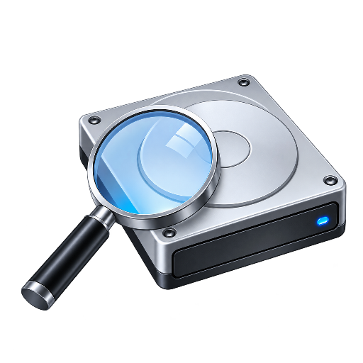

<p align="center">
  
</p>

<h1 align="center">DiskScope</h1>

<p align="center"><strong>See what is using your storage. Know what not to delete.</strong></p>

<p align="center">
  <a href="https://github.com/pcalsys/DiskScope/actions/workflows/build.yml"></a>
  <a href="https://github.com/pcalsys/DiskScope/releases/latest">Latest release</a> ·
  <a href="LICENSE">MIT License</a>
</p>

DiskScope is a privacy-first Windows storage analyzer. It finds the files and folders using the most space, then adds cautious, understandable guidance about whether an item looks personal, temporary, application-owned, or part of Windows.

Everything happens locally. DiskScope has no account, cloud service, telemetry, advertising, or network requirement.

## Highlights

- Scan a complete drive, local folder, external device, or reachable network folder.
- See results as the scan runs and cancel without losing partial results.
- Sort files by size, name, type, location, safety category, or modified date.
- Search names, paths, extensions, and types; filter by size and content category.
- Compare the 100 largest folders, including nested contents.
- Understand conservative safety ratings in a dedicated details panel.
- Open files, reveal them in Explorer, copy paths, view properties, or move eligible files to the Recycle Bin.
- Hard-block deletion actions for detected Windows and critical system files.
- Follow the Windows app theme automatically, including live changes, or select light/dark mode manually.
- Switch the complete interface live between Deutsch and English; the initial language follows Windows.
- Use the same hard-drive-and-magnifier artwork in the app, window, executable, installer, and desktop shortcut.
- Handle inaccessible folders, disappearing files, long paths, and reparse points without failing the complete scan.

## Download

The v1.0.0 release provides two x64 downloads:

- `DiskScope-1.0.0-win-x64-setup.exe` — per-user Windows installer.
- `DiskScope-1.0.0-win-x64-portable.zip` — self-contained portable build; extract and run `DiskScope.exe`.

Download them from the repository's [**Releases** page](https://github.com/pcalsys/DiskScope/releases/latest). Compare the SHA-256 value with `SHA256SUMS.txt` before running a download from an untrusted mirror.

DiskScope is self-contained and does not require a separate .NET installation. Windows 10 version 2004 or later and Windows 11 are supported.

The 1.0.0 downloads are not Authenticode-signed. Windows may therefore show a SmartScreen reputation warning. Verify the SHA-256 checksum and never disable security software merely to run DiskScope.

## Safety is intentionally conservative

DiskScope does not promise that a file is safe to delete. Ratings are deterministic guidance based on the file's path, attributes, and type—not antivirus results and not proof of ownership.

Windows and critical system files are protected in the DiskScope interface. Program files point users toward Windows uninstallation. Application data and unknown files always receive an elevated warning. Recycle actions are refused on locations without a guaranteed local Recycle Bin. See [the safety model](docs/SAFETY_MODEL.md) for exact boundaries and limitations.

## Privacy

DiskScope reads filesystem metadata needed to display scan results. It contains no HTTP client, analytics SDK, updater, advertising SDK, or account code. Settings are stored locally at `%LOCALAPPDATA%\DiskScope\settings.json`.

Read the complete [privacy statement](PRIVACY.md).

## Build from source

Requirements:

- Windows 10/11
- [.NET 8 SDK](https://dotnet.microsoft.com/download/dotnet/8.0)
- Inno Setup 6 only when building the installer

```powershell
dotnet restore DiskScope.sln --locked-mode
dotnet build DiskScope.sln -c Release --no-restore
dotnet test DiskScope.sln -c Release --no-build
```

Run the application:

```powershell
dotnet run --project src/DiskScope/DiskScope.csproj
```

Build signed-ready release artifacts:

```powershell
./scripts/build-release.ps1 -Version 1.0.0
```

If Windows PowerShell blocks local scripts by policy, run the reviewed repository script with `powershell.exe -NoProfile -ExecutionPolicy Bypass -File scripts\build-release.ps1 -Version 1.0.0`.

Outputs are written to `artifacts/release/1.0.0/` with SHA-256 checksums and a release manifest. Artifacts are not Authenticode-signed by this repository; distributors should sign them with a protected certificate before public distribution.

## Project structure

```text
src/DiskScope.Core/        Scanner, models, type and safety classification
src/DiskScope/             WPF application, themes, settings, Windows actions
tests/DiskScope.Tests/     Automated core behavior tests
tools/                     Reproducible icon generation and UI-render checks
assets/source/             Transparent master artwork for generated app assets
installer/                 Inno Setup definition
scripts/                   Build, release, verification, and publication-hygiene automation
docs/                      Architecture, safety, and release documentation
.github/                   CI, release workflow, and contribution templates
```

The [architecture guide](docs/ARCHITECTURE.md) explains performance and failure-isolation decisions.

## Contributing and security

Contributions are welcome; start with [CONTRIBUTING.md](CONTRIBUTING.md). Please report vulnerabilities privately according to [SECURITY.md](SECURITY.md), especially any path-classification bypass that could expose a protected deletion action.

DiskScope is released under the [MIT License](LICENSE).
